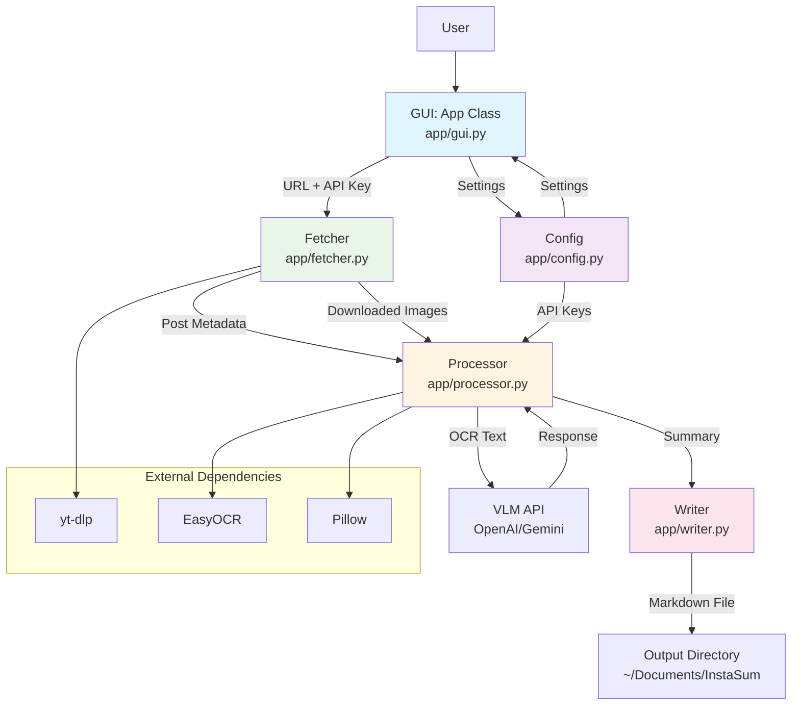

# InstaSum-Image Architecture

## Overview

InstaSum-Image is a BYOK (Bring Your Own Key) desktop application that fetches Instagram posts, extracts text using local OCR, and generates structured Markdown summaries via a Vision-Language Model (OpenAI GPT-4o or Google Gemini).

**Stats from knowledge graph**: 9 files, 261 symbols, 427 relationships, 8 functional areas, 14 execution flows.

**Entry point**: `main.py` → `app.gui.App` (CustomTkinter GUI)

## Functional Areas

The codebase is organized into a single `app` package with the following components:

| Component | File | Responsibility |
|-----------|------|----------------|
| **GUI** | `app/gui.py` | CustomTkinter application window, user input, logging display |
| **Fetcher** | `app/fetcher.py` | Instagram post metadata extraction via yt-dlp, image downloads |
| **Processor** | `app/processor.py` | Two-stage pipeline: EasyOCR → VLM summarization |
| **Writer** | `app/writer.py` | Markdown/Obsidian note generation with YAML frontmatter |
| **Config** | `app/config.py` | API key persistence (`~/.config/instasum/`), settings management |

## Key Execution Flows

### 1. Main Pipeline (Summarization)

The core execution flow when a user clicks "Summarize":

```
App._pipeline_thread (gui.py)
  └→ fetch_post (fetcher.py)
      └→ yt-dlp metadata extraction
      └→ Image downloads via requests
  └→ summarize (processor.py)
      └→ run_easyocr (local OCR)
      └→ _build_stage1_prompt
      └→ _process_openai OR _process_gemini
          └→ _encode_image_b64
  └→ write_note (writer.py)
      └→ _make_filename
      └→ _render_note
          └→ _format_date
          └→ _yaml_str
```

### 2. Configuration Loading

```
App.__init__ (gui.py)
  └→ _load_saved_values
      └→ get_api_key (config.py)
      └→ load_env (config.py)
```

### 3. Summarization Process (Detailed)

From `Summarize → _encode_image_b64` process:

| Step | Function | File |
|------|----------|------|
| 1 | `summarize` | app/processor.py |
| 2 | `_process_openai` | app/processor.py |
| 3 | `_build_openai_image_messages` | app/processor.py |
| 4 | `_encode_image_b64` | app/processor.py |

## Architecture Diagram



## Important Implementation Details

### Instagram Login Wall Handling
- **Strategy**: Pass 1 uses anonymous yt-dlp metadata extraction; Pass 2 retries with browser cookies if login wall detected
- **Cookie sources**: firefox, chrome, chromium, brave, safari, edge, opera
- **Detection**: Error messages containing "login required", "not logged in", "private", etc.

### Two-Stage Processing Pipeline
1. **Stage 1 (Local)**: EasyOCR extracts text from images (hardware-accelerated: CUDA → MPS → CPU)
2. **Stage 2 (VLM)**: Vision-Language Model (GPT-4o or Gemini) cross-references OCR text with image content

### Configuration Storage
- **API Keys**: `~/.config/instasum/config.env`
- **Settings**: `~/.config/instasum/settings.json`
- **Fallback**: `.env` file in project root (loaded if config.env not present)

### Output Format
- Markdown files with YAML frontmatter
- Obsidian-compatible
- Configurable output directory (default: `~/Documents/InstaSum`)
- Images downloaded to temp folder, deleted after processing

## Dependencies

Core dependencies from `requirements.txt`:
- `customtkinter>=5.2.0` - GUI framework
- `yt-dlp>=2024.1.0` - Instagram metadata extraction
- `easyocr>=1.7.0` - Local OCR
- `torch>=2.0.0` - OCR backend (CPU/MPS/CUDA)
- `openai>=1.30.0` / `google-genai>=1.0.0` - VLM providers
- `Pillow>=10.0.0` - Image processing
